# 📦 Proyecto Final -- Data Warehouse para E-Commerce Brazil (Olist)

Este repositorio contiene el desarrollo completo de un **Data Warehouse** construido a partir del conjunto de datos público de comercio electrónico de Brasil publicado por **Olist Store** en Kaggle.
El proyecto adopta la **arquitectura Medallón (Bronce → Plata → Oro)** e implementa procesos ETL para limpieza, normalización, modelado dimensional y análisis final.

## 🧭 Tabla de Contenidos

1.  🎯 Objetivo del Proyecto
2.  🛠️ Herramientas Utilizadas
3.  🏗️ Arquitectura
4.  📂 Sistema Fuente (Datasets)
5.  🥉 Capa Bronce
6.  🥈 Capa Plata -- Limpieza y Estandarización
7.  🥇 Capa Oro -- Modelo Dimensional
8.  📊 Dashboards en Reflex
9.  📁 Estructura del Repositorio
10. 🛠️ Ejecución Del Proyecto
11. 📚 Referencias

## 🎯 Objetivo del Proyecto

El objetivo es construir un **Data Warehouse robusto y confiable** que: 
- Integre datos provenientes de archivos CSV crudos. 
- Aplique procesos de limpieza, estandarización y control de calidad. 
- Modele un esquema dimensional eficiente para análisis. 
- Permita generar dashboards y reportes de valor. 
- Mejore la toma de decisiones para un entorno de comercio electrónico.

## 🛠️ Herramientas Utilizadas

Herramienta Uso

---

PostgreSQL Motor del Data Warehouse.
Reflex Visualización de dashboards.
GitHub Control de versiones.
Draw.io Diagramas de arquitectura.
Python Como lenguaje para crear los dashboards con ayuda de Reflex.
Trello Registro de actividades para el desarrollo del proyecto.

## 🏗️ Arquitectura

La arquitectura sigue el modelo **Medallón**:
### 🥉 Bronce
Datos en bruto, sin transformación.
### 🥈 Plata
Limpieza, estandarización e imputación.
### 🥇 Oro
Modelo dimensional orientado a análisis.

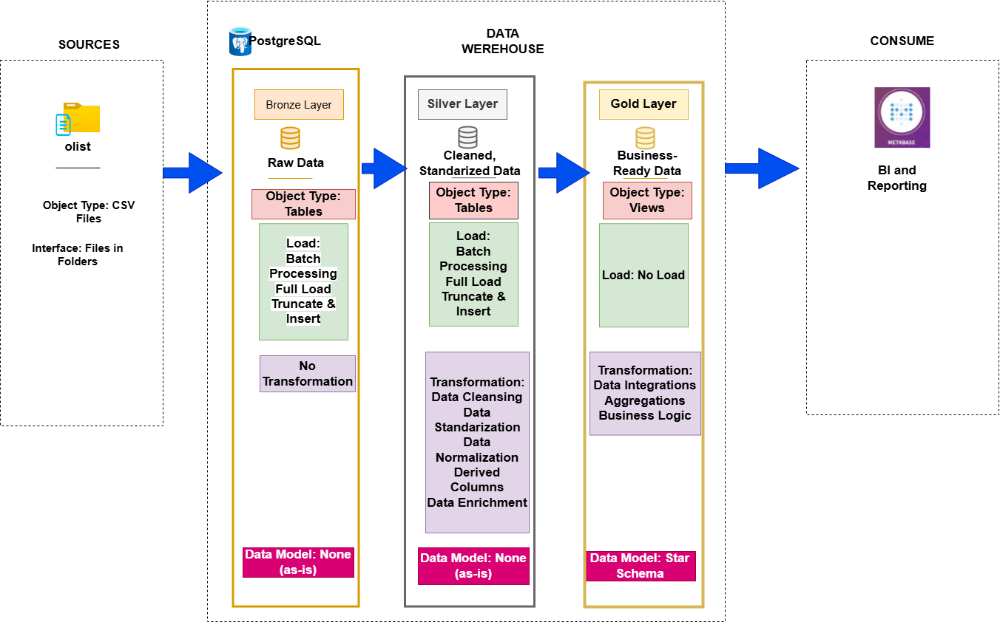

## 📂 Sistema Fuente (Datasets)

- olist_customers_dataset.csv
- olist_geolocation_dataset.csv
- olist_orders_dataset.csv
- olist_order_items_dataset.csv
- olist_order_payments_dataset.csv
- olist_order_reviews_dataset.csv
- olist_products_dataset.csv
- olist_sellers_dataset.csv
- product_category_name_translation.csv

---

📘 olist_customers_dataset.csv

Este conjunto de datos contiene información sobre los clientes y sus localizaciones.
Permite identificar clientes únicos a partir del campo customer_unique_id, ya que el mismo cliente puede tener diferentes customer_id en distintas órdenes.
Se usa para unir información de geolocalización con las órdenes del dataset principal.

<table> <tr><th style="border:2px solid black;">Campos</th><th style="border:2px solid black;">Explicación</th></tr> <tr><td style="border:2px solid black;">customer_id</td><td style="border:2px solid black;">Clave en olist_orders_dataset. Cada orden tiene un customer_id único.</td></tr> <tr><td style="border:2px solid black;">customer_unique_id</td><td style="border:2px solid black;">Identificador único del cliente para detectar recompras.</td></tr> <tr><td style="border:2px solid black;">customer_zip_code_prefix</td><td style="border:2px solid black;">Primeros cinco dígitos del código ZIP del cliente.</td></tr> <tr><td style="border:2px solid black;">customer_city</td><td style="border:2px solid black;">Ciudad del cliente.</td></tr> <tr><td style="border:2px solid black;">customer_state</td><td style="border:2px solid black;">Estado del cliente.</td></tr> </table>

---

📘 olist_geolocation_dataset.csv

Este dataset contiene los códigos ZIP de Brasil junto con sus coordenadas geográficas.
Se utiliza para calcular distancias, construir mapas y validar ciudades o estados provenientes de otros datasets (clientes o vendedores).

<table> <tr><th style="border:2px solid black;">Campos</th><th style="border:2px solid black;">Significado</th></tr> <tr><td style="border:2px solid black;">geolocation_zip_code_prefix</td><td style="border:2px solid black;">Primeros cinco dígitos del código ZIP.</td></tr> <tr><td style="border:2px solid black;">geolocation_lat</td><td style="border:2px solid black;">Latitud.</td></tr> <tr><td style="border:2px solid black;">geolocation_lng</td><td style="border:2px solid black;">Longitud.</td></tr> <tr><td style="border:2px solid black;">geolocation_city</td><td style="border:2px solid black;">Ciudad registrada.</td></tr> <tr><td style="border:2px solid black;">geolocation_state</td><td style="border:2px solid black;">Estado registrado.</td></tr> </table>

---

📘 olist_order_items_dataset.csv

Contiene los ítems incluidos dentro de cada orden.
Cada producto dentro de una orden se identifica con order_item_id, y el flete se distribuye proporcionalmente entre los ítems.

<table> <tr><th style="border:2px solid black;">Campo</th><th style="border:2px solid black;">Significado</th></tr> <tr><td style="border:2px solid black;">order_id</td><td style="border:2px solid black;">Identificador único de la orden.</td></tr> <tr><td style="border:2px solid black;">order_item_id</td><td style="border:2px solid black;">Secuencia del ítem dentro de la orden.</td></tr> <tr><td style="border:2px solid black;">product_id</td><td style="border:2px solid black;">Identificador del producto.</td></tr> <tr><td style="border:2px solid black;">seller_id</td><td style="border:2px solid black;">Identificador del vendedor.</td></tr> <tr><td style="border:2px solid black;">shipping_limit_date</td><td style="border:2px solid black;">Fecha límite de despacho.</td></tr> <tr><td style="border:2px solid black;">price</td><td style="border:2px solid black;">Precio del ítem.</td></tr> <tr><td style="border:2px solid black;">freight_value</td><td style="border:2px solid black;">Costo del flete correspondiente a este ítem.</td></tr> </table>

---

📘 olist_order_payments_dataset.csv

Incluye los datos del método y detalle del pago de cada orden.
Una orden puede tener múltiples métodos de pago.

<table> <tr><th style="border:2px solid black;">Campos</th><th style="border:2px solid black;">Significado</th></tr> <tr><td style="border:2px solid black;">order_id</td><td style="border:2px solid black;">Identificador de la orden.</td></tr> <tr><td style="border:2px solid black;">payment_sequential</td><td style="border:2px solid black;">Número de secuencia del pago.</td></tr> <tr><td style="border:2px solid black;">payment_type</td><td style="border:2px solid black;">Método de pago utilizado.</td></tr> <tr><td style="border:2px solid black;">payment_installments</td><td style="border:2px solid black;">Cantidad de cuotas del pago.</td></tr> <tr><td style="border:2px solid black;">payment_value</td><td style="border:2px solid black;">Monto total pagado.</td></tr> </table>

---

📘 olist_order_reviews_dataset.csv

Contiene las reseñas escritas por los clientes, junto con la puntuación y tiempos de respuesta.

<table> <tr><th style="border:2px solid black;">Campos</th><th style="border:2px solid black;">Significado</th></tr> <tr><td style="border:2px solid black;">review_id</td><td style="border:2px solid black;">Identificador único de la reseña.</td></tr> <tr><td style="border:2px solid black;">order_id</td><td style="border:2px solid black;">Orden asociada.</td></tr> <tr><td style="border:2px solid black;">review_score</td><td style="border:2px solid black;">Puntuación (1 a 5).</td></tr> <tr><td style="border:2px solid black;">review_comment_title</td><td style="border:2px solid black;">Título de la reseña.</td></tr> <tr><td style="border:2px solid black;">review_comment_message</td><td style="border:2px solid black;">Contenido del comentario.</td></tr> <tr><td style="border:2px solid black;">review_creation_date</td><td style="border:2px solid black;">Fecha en que el cliente envió la reseña.</td></tr> <tr><td style="border:2px solid black;">review_answer_timestamp</td><td style="border:2px solid black;">Fecha en que la tienda respondió la reseña.</td></tr> </table>

---

📘 olist_orders_dataset.csv

Este es el dataset central del proyecto.
Cada orden está conectada con clientes, ítems, pagos, reseñas y fechas logísticas.

<table> <tr><th style="border:2px solid black;">Campo</th><th style="border:2px solid black;">Significado</th></tr> <tr><td style="border:2px solid black;">order_id</td><td style="border:2px solid black;">Identificador único de la orden.</td></tr> <tr><td style="border:2px solid black;">customer_id</td><td style="border:2px solid black;">Clave al dataset de clientes.</td></tr> <tr><td style="border:2px solid black;">order_status</td><td style="border:2px solid black;">Estado de la orden (delivered, shipped, etc.).</td></tr> <tr><td style="border:2px solid black;">order_purchase_timestamp</td><td style="border:2px solid black;">Fecha de compra.</td></tr> <tr><td style="border:2px solid black;">order_approved_at</td><td style="border:2px solid black;">Fecha de aprobación.</td></tr> <tr><td style="border:2px solid black;">order_delivered_carrier_date</td><td style="border:2px solid black;">Fecha en que el delivery recibió el paquete.</td></tr> <tr><td style="border:2px solid black;">order_delivered_customer_date</td><td style="border:2px solid black;">Fecha de entrega al cliente.</td></tr> <tr><td style="border:2px solid black;">order_estimated_delivery_date</td><td style="border:2px solid black;">Fecha estimada de entrega.</td></tr> </table>

---

📘 olist_products_dataset.csv

Dataset que contiene información estructural sobre los productos vendidos.

<table> <tr><th style="border:2px solid black;">Campos</th><th style="border:2px solid black;">Significado</th></tr> <tr><td style="border:2px solid black;">product_id</td><td style="border:2px solid black;">Identificador del producto.</td></tr> <tr><td style="border:2px solid black;">product_category</td><td style="border:2px solid black;">Categoría raíz (en portugués).</td></tr> <tr><td style="border:2px solid black;">product_name_length</td><td style="border:2px solid black;">Longitud del nombre del producto.</td></tr> <tr><td style="border:2px solid black;">product_description_length</td><td style="border:2px solid black;">Longitud de la descripción.</td></tr> <tr><td style="border:2px solid black;">product_photo_qty</td><td style="border:2px solid black;">Cantidad de fotos del producto.</td></tr> <tr><td style="border:2px solid black;">product_weight_g</td><td style="border:2px solid black;">Peso en gramos.</td></tr> <tr><td style="border:2px solid black;">product_length_cm</td><td style="border:2px solid black;">Longitud en cm.</td></tr> <tr><td style="border:2px solid black;">product_height_cm</td><td style="border:2px solid black;">Altura en cm.</td></tr> <tr><td style="border:2px solid black;">product_width_cm</td><td style="border:2px solid black;">Ancho en cm.</td></tr> </table>

---

📘 olist_sellers_dataset.csv

Contiene información de los vendedores que procesan pedidos para Olist.

<table>
<tr style="border:2px solid black;">
<th style="border:2px solid black;">Campo</th><th >Significado</th>
</tr> 
<tr style="border:2px solid black;"><td style="border:2px solid black;">seller_id</td><td >Identificador único del vendedor.</td>
</tr> <tr style="border:2px solid black;"><td style="border:2px solid black;">seller_zip_code_prefix</td><td>Primeros cinco dígitos del ZIP.</td></tr> <tr style="border:2px solid black;"><td>seller_city</td><td style="border:2px solid black;">Ciudad del vendedor.</td></tr> <tr style="border:2px solid black;"><td style="border:2px solid black;">seller_state</td><td>Estado del vendedor.</td></tr> </table>

---

📘 product_category_name_translation.csv

Dataset de apoyo para traducir categorías del portugués al inglés.

<table> <tr><th style="border:2px solid black;">Campo</th><th style="border:2px solid black;">Significado</th></tr> <tr><td style="border:2px solid black;">product_category_name</td><td style="border:2px solid black;">Nombre de la categoría en portugués.</td></tr> <tr><td style="border:2px solid black;">product_category_name_english</td><td style="border:2px solid black;">Nombre traducido al inglés.</td></tr> </table>

## 🥉 Capa Bronce

Carga cruda mediante tablas espejo y procesos Truncate + Insert.

## 🥈 Capa Plata -- Limpieza y Estandarización

Incluye limpieza de productos, geolocalización, clientes, vendedores, órdenes, ítems de órdenes, pagos y reseñas. Algunos de los controles realizados en las entidades se muestran a continuación:

---

📦 Productos

Imputación de nulos usando la mediana por categoría.

Cálculo de peso faltante: peso = alto × ancho × largo × factor.

Normalización de texto y eliminación de espacios.

Corrección de valores ≤ 0 en dimensiones.

Asignación de 0 cuando faltan longitudes o fotos.

---

🗺️ Geolocalización

Promedio de latitud y longitud por código ZIP.

Eliminación de duplicados derivados de múltiples lecturas GPS.

Validación cruzada con clientes y vendedores.

Identificación de ciudades no presentes en este dataset mediante Python y PostgreSQL.

---

👤 Clientes

Validación de unicidad de customer_id.

customer_unique_id repetido aceptado (recompras).

Corrección de errores de tipeo en ciudades mediante:

Coincidencia parcial.

Comparación con ZIP.

Fuentes externas cuando es posible.

Registros sin fuente confiable se mantienen.

---

🛒 Vendedores

Proceso igual al de clientes:

Validación de ZIP.

Control de nulos.

Corrección de ciudades cuando aplica.

---

📦 Órdenes

Controles aplicados:

No nulos en order_id y customer_id.

No duplicados en order_id.

Validación secuencial de fechas:

purchase

approved

delivered_carrier

delivered_customer

Corrección automática:

Si una fecha es incoherente → se ajusta para que sea un día mayor.

Se aplica solo a órdenes delivered.

---

🛍️ Ítems de Orden

price > 0

freight_value ≥ 0

---

💳 Pagos

payment_value > 0 excepto para voucher y not_defined.

payment_sequential > 0

payment_installments > 0

Corrección para casos donde figura 0 cuotas.

Comparación del monto total pagado vs. costo total de la orden.

---

⭐ Reseñas

review_creation_date <= review_answer_timestamp

review_score > 0, caso contrario → imputación con mediana.

  

## 🥇 Capa Oro -- Modelo Dimensional

### Dimensiones

- dim_customers
- dim_sellers
- dim_products
- dim_calendar
- dim_status

### Hechos

- fact_sales

### Granularidad

- Un registro en la tabla de hechos representa un item de compra.

  
  
Diagrama Del Modelo Estrella

  
  
Diagrama Del Flujo De Datos

## 📊 Dashboards en Reflex

Incluyen análisis de ventas como principal tabla de hechos. Permitirá mostrar de manera dinámica las ventas
por cliente, vendedor, ciudades, estados, estados de las ordenes, y diferentes ámbitos de fecha como ser:
por mes, por día, por cuatrimestre, etc.

## 📁 Estructura del Repositorio

📦 Repo-ProyectoFinal-Devlight

├── Documentacion

│       ├── drawio

│       ├── imagenes

├── Scripts

│       ├── Bronze

│       ├── Silver

│       ├── Gold

└── README.md

<ul>
<li>Documentacion: Los diferentes artefactos para explicar las partes del proyecto.
  <ul>
    <li>drawio: Los archivos drawio empleados</li>
    <li>imagenes: Los imagenes del flujo de datos, arquitectura, relaciones entre entidades,etc.</li>
  </ul>
</li>
<li>Scripts: Los scripts para la creación de las capas, creación de las tablas, limpieza, imputación, estandarización y control en cada una de ellas.
  <ul>
    <li>Bronze: Scripts para la creación de la capa bronce y la carga de los datos crudos</li>
    <li>Silver: Scripts para la creación de la capa plata, limpieza, imputación, estandarización y carga de las tablas.</li>
     <li>Oro: Scripts para la creación de la capa oro. Creación del modelo estrella con las tablas de hechos y dimensiones.</li>
  </ul>
</li>
</ul>
    

## 📚 Ejecución Del Proyecto

### Haciendo Funcionar A Docker

El proyecto fue ejecutado en Docker. Éste puede ser instalado siguiendo las instrucciones indicadas en el enlace: <a href="https://www.docker.com/get-started/">Iniciar Con Docker</a>.
Una vez instalado Docker, empleamos el siguiente archivo para  docker-compose:
<code>
version: "3.9"

services:
  postgres:
    build:
      context: .
      dockerfile: Dockerfile
    container_name: postgres_bootcamp
    restart: unless-stopped
    environment:
      POSTGRES_USER: myuser
      POSTGRES_PASSWORD: mypassword
      POSTGRES_DB: bootcamp_db
    ports:
      - "5432:5432"
    volumes:
      - ./pgdata:/var/lib/postgresql/data
      - ./import_data:/import_data
    networks:
      - postgres_network
    healthcheck:
      test: ["CMD-SHELL", "pg_isready -U myuser -d bootcamp_db"]
      interval: 10s
      timeout: 5s
      retries: 10
      start_period: 30s

  pgadmin:
    image: dpage/pgadmin4:latest
    container_name: pgadmin_bootcamp
    restart: unless-stopped
    environment:
      PGADMIN_DEFAULT_EMAIL: admin@example.com
      PGADMIN_DEFAULT_PASSWORD: admin123
    ports:
      - "8080:80"
    volumes:
      - pgadmin_data:/var/lib/pgadmin
      - ./import_data:/import_data
    networks:
      - postgres_network
    depends_on:
      postgres:
        condition: service_healthy

  metabase:
    image: metabase/metabase:latest
    container_name: metabase_bootcamp
    restart: unless-stopped
    environment:
      MB_DB_TYPE: postgres
      MB_DB_DBNAME: bootcamp_db
      MB_DB_PORT: 5432
      MB_DB_USER: myuser
      MB_DB_PASS: mypassword
      MB_DB_HOST: postgres
    ports:
      - "3000:3000"
    volumes:
      - metabase_data:/metabase-data
    networks:
      - postgres_network
    depends_on:
      - postgres
    healthcheck:
      test: curl --fail -s http://localhost:3000/api/health || exit 1
      interval: 30s
      timeout: 10s
      retries: 3
      start_period: 60s

  
networks:
  postgres_network:
    driver: bridge

volumes:
  pgadmin_data:
  metabase_data:
</code>

Y el siguiente archivo para Dockerfile

<code>
  FROM postgres:16
  EXPOSE 5432

  VOLUME ["/var/lib/postgresql/data"]
</code>

En la carpeta donde se colocan ambos archivos, se debe crear una carpeta llamada import_data. Dentro de esa carpeta se debem colocar los archivos csv descargados desde Kaggle.
Cuando esté todo listo, sólo debemos abrir Docker Desktop (una vez instalado) y seleccionar la opción mostrada en rojo. Eso nos abrirá la terminal indicada en verde

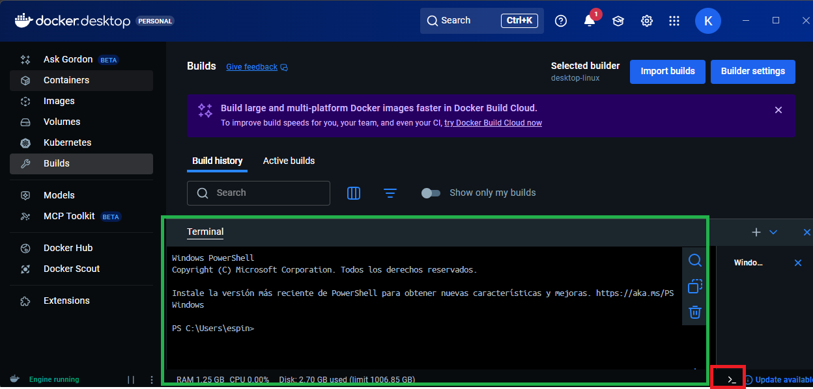

En la terminal, debemos escribir <i>cd ruta</i>, donde ruta indica la ruta de la carpeta donde colocamos el archivo composer-yaml y Dockerfile.

En la imagen anterior vemos los comandos de la terminal de Docker. Primero, lo indicado en verde, es para ir al directorio en donde tenemos colocados los archivos composer-yaml y Dockerfile. Lo indicado en rojo es la manera de levantar las imágenes: <i><b>docker-compose up -d postgres pgadmin</b></i>.
Si es la primera vez que ejecutan el comando, tardará unos minutos en traer las imágenes desde Docker Hub y, después de un tiempo, deben ver algo similar a esto en la terminal:

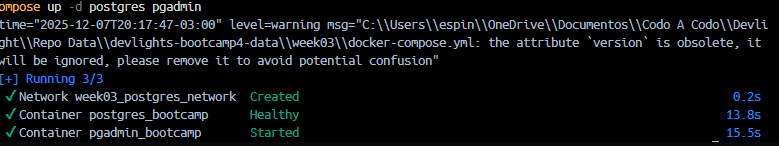

Si les aparece eso, entonces todo está funcionando correctamente. Podrán entrar al pgadmin haciendo: <i>localhost:8080</i>

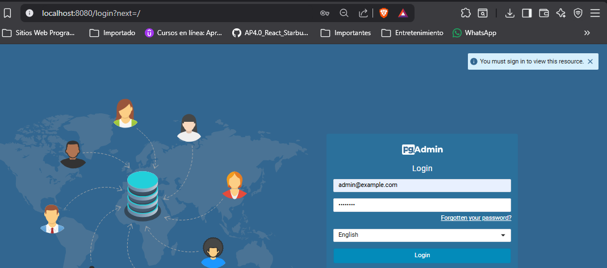

El usuario es <i>admin@example.com</i> y la contraseña será <i>admin123</i>. Los archivos para docker lo pueden encontrar en <i><b>Documentacion/archivos/docker</b></i>

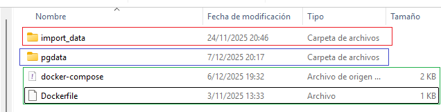

La última imagen muestra un ejemplo de cómo debe quedar la carpeta con los archivos. Si se clona este repositorio y se ejecutan los comandos de Docker, será allí donde se guarden las imágenes y volumenes del mismo. Pero, si quieres colocarlo en una carpeta en particular, sólo debes bajar los archivos composer-yaml, Dockerfile y colocarlo en la carpeta deseada. La carpeta indicada en azul es la que crea Docker. Pero la carpeta indica en rojo debes crearla manualmente y colocar allí los archivos CSV.

### Creando El Servidor y La Base De Datos

Una vez que se haya iniciado sesión en pgadmin, lo primero es crear un servidor para empezar a trabajar. Para ello, en las opciones de la izquierda hacemos click derecho en <i>Servers->Register->Server</i>

Eso nos mostrará las opciones generales

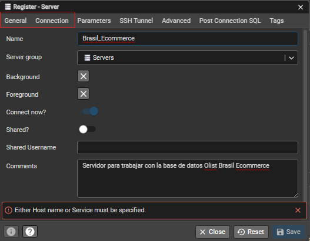

Y las opciones de conexión

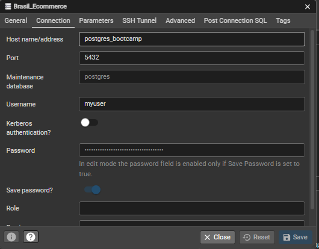

En las opciones de conexión, si se usan los documentos de docker indicados en este repositorio, debemos colocar los siguientes datos para el host, usuario y constraseña 

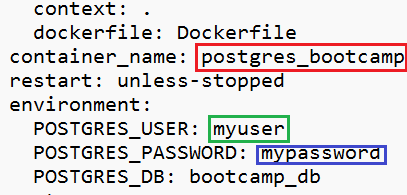

Si le damos a la opción Save, obtendremos el resultado mostrado en la siguiente imagen y con eso nuestro servidor estará listo.

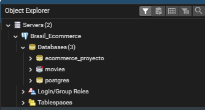

En la imagen superior se pueden ver varias bases de datos creadas, pero es posible que en tu caso no veas ni una, o quizás sólo veas la base de datos llamada postgres. En cualquier caso, debes crear una nueva base de datos haciendo click derecho sobre el nombre del servidor, luego la opción Create y finalmente la opción Database

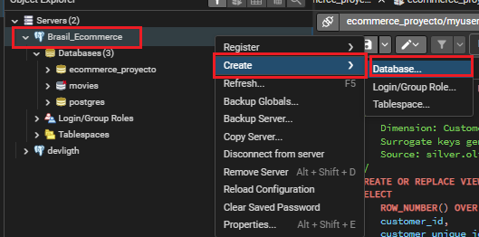

Le damos un nombre a la base de datos y la creamos

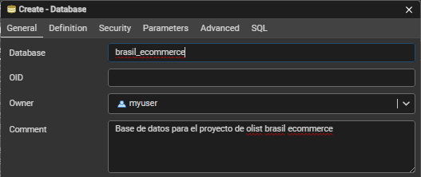

Se da click en el botón Save y la base de datos debe estar creada

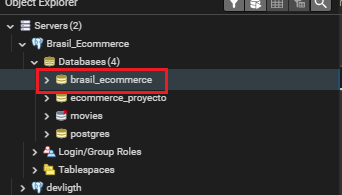

Una forma rápida para ejecutar los scripts en pgadmin es hacer click derecho sobre la base de datos creada y elegir la opción Query Tool

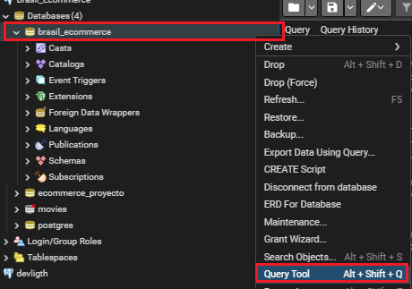

Esto nos abrirá una ventana donde podremos realizar consultas SQL. Nos daremos cuenta que esa venta ejecutará las consultas SQL sobre la base de datos en cuestión porque veremos señalado el nombre de la base de datos, como lo muestra la siguiente imagen

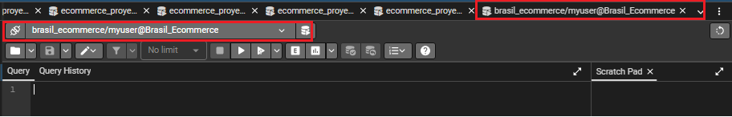

Allí podremos pegar los códigos de nuestros scripts. Por ejemplo, podemos abrir el script <i>ddl_bronze_layer.sql</i> y copiar ese código en la ventana de query que acabamos de crear. Luego, simplemente le damos a F5 y se crearán las tablas de la capa bronze. <b>Es importante que previamente los archivos CSV estén colocados en la carpeta import_data como se indicó anteriormente.</b>
Podemos revisar que las tablas han sido creadas buscando en las opciones de la izquierda la opción Schema. Allí veremos que aparecerán dos: public y bronze. El esquema bronze es el que tiene las tablas con la información necesaria.

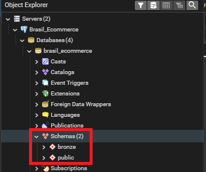

Cuando veamos que está correctamente creado, ahora debemos ejecutar el script <i><b>proc_load_bronze.sql</b></i>. Este script nos creará un procedimiento almacenado llamado <i><b>sp_load_data</b></i>. Para saber si después de ejecutar el script el procedimiento se creó correctamente, debemos ir a la base de datos: 
<i>brasil_ecommerce->schema->bronze->Procedures</i>
 y deberíamos notar lo que muestra la siguiente imagen:

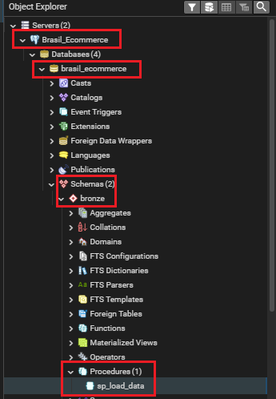

Con el procedimiento ya creado, podemos escribir el siguiente comando SQL:

<i>CALL bronze.sp_load_data()</i>

Luego de escribir el comando, lo ejecutamos y eso permitirá cargar los datos en las tablas de la capa bronce.
Si todo salió correcto, deberíamos ver la siguiente leyenda en la consola de mensajes:

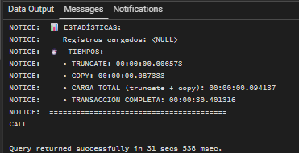

Y para ver que las tablas están correctamente cargadas, pueden realizar la siguiente consulta:

<i>select * from bronze.olist_customers limit 1;</i>
 

Si les aparecen los resultados, es que las tablas se cargaron correctamente.

## 📚 Referencias

1.  Olist Dataset (Kaggle):https://www.kaggle.com/datasets/olistbr/brazilian-ecommerce/
2.  Baraa Khatib -- Data Warehouse Project: https://github.com/DataWithBaraa/sql-data-warehouse-project
3.  SQL Data Warehouse from Scratch | Full Hands-On Data Engineering Project-Data with Baraa: https://www.youtube.com/watch?v=9GVqKuTVANE&list=PLNcg_FV9n7qaUWeyUkPfiVtMbKlrfMqA8
4.  Lista de Municípios Brasileiros e Informações Adicionais: https://blog.mds.gov.br/redesuas/lista-de-municipios-brasileiros/
5.  Postgres SQL Generar diccionario de datos: https://gist.github.com/juelvaldivia/15f90280a86997faca1cf5997ff0a683
6.  Documentación De Docker: https://docs.docker.com/
7. Documentación PostgreSQL: https://www.postgresql.org/docs/
